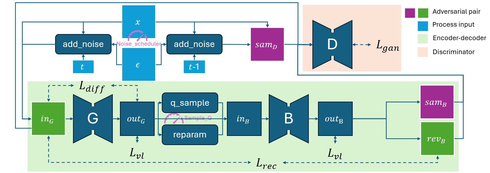

<div align="center">
    <h1 align="center">Generative Model Zoo</h1>
    
    
    
    
    
    
    
    
    
</div>

This repository provides unified framework to train common un-conditional generative models, including VAE, GAN, Diffusion model and flow matching. 

### Install
* Virtual environment: Use [uv](https://github.com/astral-sh/uv) to create environment and install packages. Change `gai-zoo` as any name you want.
```shell
$ uv venv ./venv/gai-zoo --python python3.11
$ source ./venv/gai-zoo/bin/activate
$ uv pip install .
$ touch .project-root
```
* Docker: Directly build image and install the dependency.
```shell
$ docker build -t gai-zoo:latest -f Dockerfile .
$ docker run --gpus "device=0" -it -d ${shell pwd}:/home/gai-zoo --name gai-zoo gai-zoo:latest /bin/bash
```

### Usage

* You can simply train & sampling for MNIST diffusion model with argparse
```shell
# Train MNIST diffusion model
python3 src/train.py

# Sampling for MNIST diffusion model
python3 src/eval.py
```

* For advance, we use hydra to extend other various models, including AE, GAN and Diffusion model.
```shell
# Train diffusion model
python3 hydra_wrapper.py --task train optimizer=diffusion loss=diffusion model=size_32_g     noise_scheduler=diffusion method=diffusion

# Train flow matching model
python3 hydra_wrapper.py --task train optimizer=diffusion loss=diffusion model=size_32_g     noise_scheduler=fm        method=euler

# Train GAN
python3 hydra_wrapper.py --task train optimizer=style-gan loss=lsgan     model=size_32_g_d   '~noise_scheduler'

# Train Auto-encoder
python3 hydra_wrapper.py --task train optimizer=diffusion loss=ae        model=size_32_g_b   '~noise_scheduler'

# Train VAE
python3 hydra_wrapper.py --task train optimizer=diffusion loss=vae       model=size_32_g_b   '~noise_scheduler' model.G.out_channels=2 +model.sample_G=reparam

# [Dev] Train VQVAE
python3 hydra_wrapper.py --task train optimizer=diffusion loss=vqvae     model=size_32_g_q_b '~noise_scheduler'

# Sampling for MNIST diffusion model via hydra
python3 hydra_wrapper.py --task eval grid=1 +model.sample_G=q_sample
```