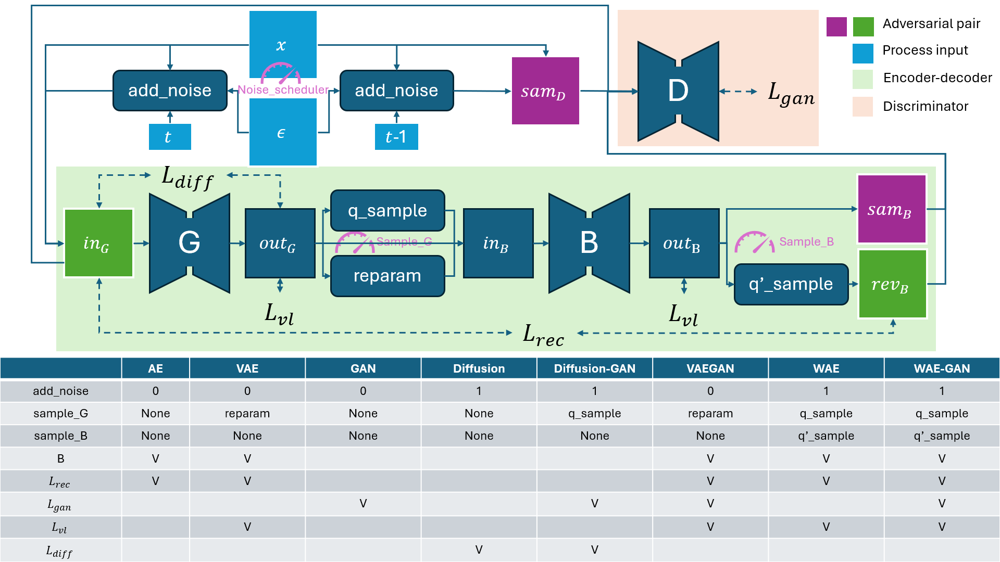

<div align="center">
    <h1 align="center">Generative Model Zoo</h1>
    
    
    
    
    
    
    
</div>

This repository provides unified framework to train common generative models, including VAE, GAN and Diffusion model. 

### Usage

* With argparse
```shell
# Train MNIST diffusion model
python3 train.py

# Sampling for MNIST diffusion model
python3 eval.py
```

* With hydra
```shell
# Train MNIST diffusion model via hydra
python3 hydra_wrapper.py --task train batch_size=16

# Sampling for MNIST diffusion model via hydra
python3 hydra_wrapper.py --task eval grid=1
```